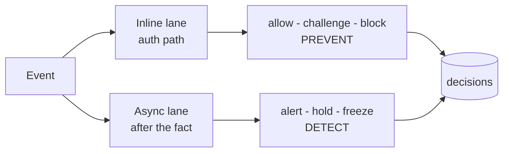
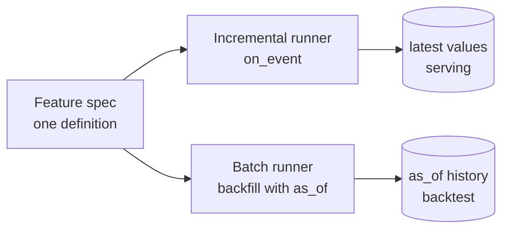
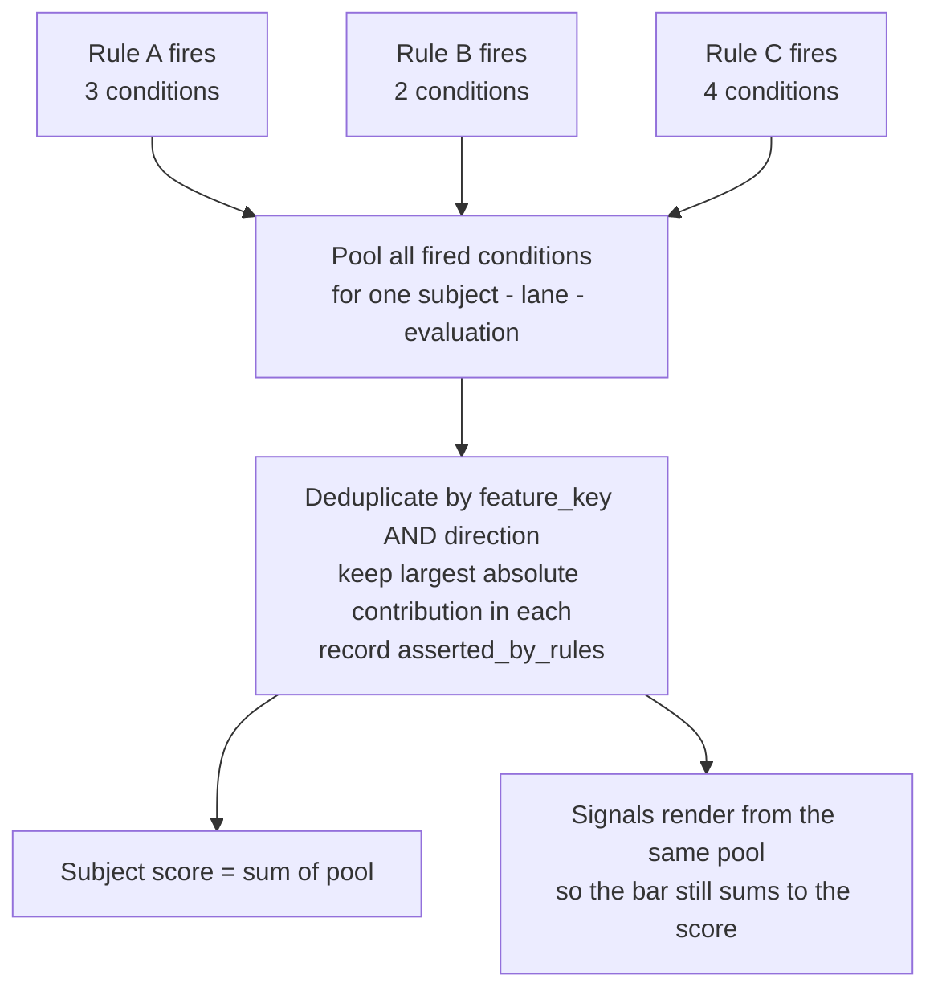

# GlassBox — Architecture

**Risk Intelligence & Fraud Detection Platform**

---

## Read this first

This document is organized by **what four weeks actually build**, not by what the
system would look like in production. The two are different, and conflating them is
how a prototype gets evaluated as if it were ready to carry money.

| Part | Contains | Applies to |
|---|---|---|
| **I** | Prototype architecture — twelve items, all contract-shaping | Weeks 2–4 |
| **II** | Columns and small tables to record now because they cannot be reconstructed later | Weeks 2–4, near-zero cost |

**If you are evaluating the prototype, read Part I and stop.** Part II is a list of
columns to record while recording them is free; it is not additional scope.

Production concerns — ingestion adapters, third-party enrichment, models, alert volume
at scale, audit hardening, observability — are **out of scope and not described here**.
Where a Part I item stops short of one deliberately, it says so in a line and moves on.

The organizing distinction throughout is **contract-shaping** versus **operational**:

| | Expensive to retrofit | Cheap to add later |
|---|---|---|
| **Build now** | the twelve items of Part I | — |
| **Record now** | `fail_mode`, `rule_version_set`, `feature_version_set`, `degraded_features`, `action_source_rule` and the rest of Part II | — |
| **Note and move on** | — | anything that can be bolted on without reshaping a stored row |

### Why this is twelve items and not six

The previous revision listed six. Two things changed.

**The KPI tiles are now in scope as real analytics, not illustration.** That decision
has consequences that are not reporting work: alert volume counts evaluation cycles
rather than cases unless deduplication exists; per-rule precision needs the rule
attribution that consolidation discards; block rate counts intentions rather than
blocks until action execution is recorded. Three items move out of the deferred list
and into Part I for that reason alone (§8, §6, §9).

**A review found gaps in the six.** The material ones: rules have no defined way to
resolve their subject to a feature's entity (§3.2), absent features are silently
treated as non-firing in both directions when the two signs need opposite policies
(§5), a veto rule can never exercise a veto under the precedence rules as written
(§7), feature definitions become mutable data without becoming versioned data (Part II),
and the read contract that §10 and §11 of the last revision both referenced was never
written down (§12).

Twelve items do not fit in one week. §17 says so plainly and proposes where the cut
line goes.

**Status marks** used throughout: **BUILT** (exists and has been executed end to end),
**SPEC** (designed, not yet built), **DEFER** (out of prototype scope, recorded so it
isn't forgotten).

---

# Part I — Prototype architecture

## 1. The invariant

Everything below serves one property, and any component that would break it is wrong
regardless of its other merits:

> **No decision exists without a complete, additive, human-readable explanation of how
> it was reached — and the explanation reconstructs both the score and the action
> exactly.**

Formally: `score = Σ(signal contributions)`, where every signal cites a catalog feature
or a named model, carries a signed point value, and renders as a sentence an analyst
can act on. The name GlassBox is this invariant and nothing else.

**The action clause is new, and it is the more important half.** The previous revision
stated the invariant over the score only. But the score is a number and the action is
what touches a customer, and §7 determines the action by a *different* computation than
the one that produces the score — max severity among individually-triggering rules,
subject to veto. Under the old wording an analyst could see a consolidated 82/HIGH whose
action came from a rule scoring 58, or a veto capping a high score at `monitor` with
nothing on screen explaining why. The thing with the weaker guarantee was the thing with
the higher stakes.

Three consequences shape the design:

- Any scoring mechanism that cannot decompose additively — a raw model output, an
  opaque vendor score — enters as **one signal among many with its own contribution**,
  never as the score itself.
- Consolidating multiple rules cannot use any method that breaks the sum (§6). That
  constraint eliminates the obvious approaches, which is why it is specified rather
  than left to implementation.
- Every input to the action decision is recorded and renderable: which rule carried the
  action (`action_source_rule`), which vetoes applied and why (as `alert_signals` rows),
  and which features were absent or stale when the decision was made
  (`degraded_features`).

**BUILT.** The Week-1 scorer computes scores additively and reproduces the console's
87 / 64 / 58 / 31 in SQL, with every point accounted for in `alert_signals`. The action
half of the invariant is **SPEC** — §7 and §8.

## 2. Shape

### 2.1 Two lanes



| | **Inline** | **Async** |
|---|---|---|
| Budget | 50 ms p99 | seconds to minutes |
| Reads | `inline_capable` features only | everything |
| Rules | R-114, T-021 | L-203, S-077 |
| Point-in-time bound | `as_of <= occurred_at` | `as_of <= occurred_at + evaluation_lag` (§4) |
| On failure | fail-open, **recorded** | retry |

A rule is inline **only if** every feature it reads is `inline_capable` **and** its
decision resolves inside a single-event window. Graph and sequence rules fail the
second test by construction — which is why L-203 and S-077 are async and no amount of
optimization changes that.

Both lanes write the same `decisions` table, so KPIs span prevention and detection
without reconciliation. **BUILT** (the table and the mode distinction; the lanes
themselves are Week 2).

### 2.2 Evaluation cycles — **SPEC**

The last revision asserted "one decision per event" (§6) while specifying two lanes that
both write a decision for the same event (§2.1). Both are right; the scope was
under-specified. It is stated here because consolidation, alert deduplication and the
alert-volume KPI all depend on it.

An **evaluation** is one pass of one lane over one subject, identified by
`evaluation_id` and carrying a recorded `evaluation_trigger`:

| Lane | Subject types | Trigger | Cadence |
|---|---|---|---|
| Inline | `transaction` | authorization request | per event |
| Async | `transaction`, `account`, `card`, `customer` | transaction or event arrival | per arriving row |
| Async | `network` | scheduled graph cycle | every 15 min (prototype) |
| Either | any | manual replay / backtest | on demand |

Consolidation (§6) produces one decision per **(subject, lane, evaluation_id)** — not
one per subject for all time. A ring re-evaluated on the next graph cycle produces a
second decision, correctly; what it must *not* produce is a second alert (§8).

The 15-minute figure is a prototype placeholder and is one of the open decisions in §18.
It matters more than it looks: it sets the floor on detection latency for every network
pattern, and it is the denominator of anything measured "per cycle."

### 2.3 Where extensibility lives

The **control plane** (feature catalog, rules, thresholds) is what admins change. The
**decision plane** (ingest, features, engine, alerts) is an *interpreter* of what the
control plane publishes, and must never need a deploy to gain a fraud pattern. Where
the interpreter is too weak to express a pattern, the fix is to strengthen the
interpreter once — not to add a special case.

The honest limits of this today: the engine interprets only `feature OP constant`; there
is no declarative way to define a feature at all; and there is no declarative way to
say which *entity* a feature should be read for. §3 is the fix for all three, and it is
item 1 for that reason.

## 3. Item 1 — Feature computation specs and runners — **SPEC**

*Contract-shaping: every downstream component reads what this produces.*

`feature_catalog` currently registers that a feature **exists**; nothing states how it
is **computed** or **which entity it is computed for**. The Week-1 generator derived
values in Python off to the side. So "add a feature" today means "write code that lives
nowhere in this deliverable" — which quietly negates the claim that a new pattern costs
only inserts.

### 3.1 Computation specs stored as data, interpreted by runners

| Field | Purpose | Example |
|---|---|---|
| `source_kind` | how it's produced | `aggregate` `lookup` `expression` `sequence` `graph` |
| `source_relation` | what it reads | `transactions` `events` `entity_links` |
| `subject_key` | entity it keys on | `card_id` `account_id` `cluster_id` |
| `resolution_path` | how a rule's subject reaches that entity (§3.2) | `transaction.card_id` |
| `filter_predicate` | structured WHERE | `channel = 'cnp' AND auth_result = 'approved'` |
| `aggregation` | reducer | `count` `sum` `distinct_count` `ratio` `zscore` `bool_exists` `min_gap` |
| `window_spec` | lookback | `90s` `24h` `7d` `30d` |
| `baseline_spec` | comparison window for ratios and z-scores | `30d` |
| `refresh` | when it runs | `on_event` `batch` `on_demand` |
| `max_staleness` | age past which the value is unusable (§5) | `5m` `1h` `24h` |
| `default_when_absent` | explicit missing-data policy | `0` `false` `null` |
| `spec_version` | bumped on any change to the fields above (Part II) | `3` |

`max_staleness` and `spec_version` were both referenced elsewhere in the last revision
without ever being defined here — the stale-feature policy in §5 relies on "stale beyond
max" and Part II relies on knowing which definition produced a stored value. They are part
of the feature spec format, which is the contract most expensive to change later.

`card_cnp_count` becomes a row, not a function:

```
source_kind=aggregate   source_relation=transactions   subject_key=card_id
resolution_path=transaction.card_id
filter_predicate={channel: cnp, auth_result: approved}
aggregation=count   window_spec=90s   refresh=on_event
max_staleness=5m   default_when_absent=0   inline_capable=true
```

**One spec, two runners:**



Two runners from one definition is how train/serve skew is prevented. If serving and
training each implement a feature separately they **will** diverge, and the divergence
is invisible until a model trained on one is served the other. A **consistency test**
runs the batch runner over a window and asserts it reproduces what the incremental
runner wrote.

**Scope limit, stated plainly.** `expression` features need an evaluator, and any
evaluator is a small language: too narrow and admins hit walls, too wide and it is an
injection surface with unbounded runtime. Prototype supports `aggregate`, `lookup`,
`sequence`, `graph`, and **restricted arithmetic** over already-registered features
(`+ - * /`, comparison, `min` `max` `abs`) — no loops, no I/O, no user functions.
Anything beyond that is a data-engineering ticket, not an admin action, and the UI
should say so rather than imply otherwise.

### 3.2 Subject-to-entity resolution — **SPEC (known defect)**

This is the gap that makes population scoring meaningless until it is closed, and it is
invisible at four fixtures.

The catalog says `card_cnp_count` keys on `card`, `mcc_is_new_for_customer` on
`customer`, `device_first_seen_min` on `device`. R-114's subject is `transaction`. The
scorer joins:

```sql
JOIN latest fv ON fv.feature_key = c.feature_key
              AND fv.entity_type = r.subject_type
```

There is **no predicate on entity identity at all**, and no join path from a transaction
to its card. The demo works only because the generator sidesteps the problem: it writes
every one of R-114's features with `entity_type='transaction'` and the transaction's own
id, flattening card, customer and device features onto the transaction so the join
lands. The catalog and the stored values disagree about what these features key on, and
nothing detects it.

Two consequences at population scale, both of which produce plausible-looking wrong
answers rather than errors:

- Every transaction carrying *any* one of a rule's features partially fires that rule and
  scores from whatever happens to be present. R-114 fires at 14 on a transaction whose
  only stored feature is `mcc_is_new_for_customer`.
- `rule_conditions.condition_group` and `rule_definitions.combine` are written by the
  seed and **read by nothing**. There is no AND within a rule. Partial firing is not a
  bug in the join alone; the engine has no concept of a rule failing to satisfy.

**Fix.** `resolution_path` on the catalog declares how a rule subject reaches the
feature's entity (`transaction.card_id`, `transaction.customer_id`, `account.customer_id`,
`transaction → device_id`). The engine resolves the path, keys the lookup on the resolved
entity id, and evaluates `combine` / `condition_group` before a rule is allowed to
contribute. A rule whose required conditions are unsatisfied does not produce a partial
score.

**Acceptance:** R-114 evaluated over the full dataset fires on transactions where all
four conditions resolve and hold, and on no others; the seeded `combine` value changes
the outcome when flipped to `OR`.

### 3.3 Cluster registry — **SPEC**

`network` is a subject type, `RING-1187` is a subject id, and nothing creates cluster
ids. The generator minted that one by hand, and `score_and_verify.sql` hardcodes both
`'RING-1187'` and `'DEV-F90D2'` in its `alert_subjects` insert — in a file whose header
claims the model is populated "from data alone (no per-pattern code)."

The graph builder in §15 needs an output relation: `clusters` (cluster_id, cluster_type,
first_seen, last_seen, member_count) and `cluster_members` (cluster_id, subject_type,
subject_id, role, joined_at). Graph features key on `cluster_id`; `alert_subjects` is
populated from `cluster_members` rather than from a hardcoded predicate.

Cluster *identity over time* — clusters growing, splitting and merging while an analyst
needs one trackable case — is genuinely hard and is **out of scope**; a cluster keeps the
id its first run gave it. Cluster *existence* is not deferrable: without it, no network subject can be scored across a
population, and the ring case remains a fixture rather than a pattern.

**Acceptance:** the ring alert's four member accounts come from `cluster_members`;
`score_and_verify.sql` contains no literal subject ids.

## 4. Item 2 — Point-in-time selection — **SPEC (known defect)**

*Contract-shaping: silently wrong results that look right.*

Every feature value is stamped `as_of` (**BUILT**). The scorer must select the value
that existed at decision time, not the latest one. It currently takes `latest`. With one
value per feature those are indistinguishable — which is exactly why four fixtures could
not catch it. The moment history exists, the scorer reads the future: a backtest scores
January with February's values and returns optimistic numbers that never survive contact
with production.

This is the single largest correctness risk in the system, and it is cheap to fix now
and expensive to discover later, because the failure produces *plausible* results rather
than errors. Three parts to the fix.

**Which timestamp.** `decisions` carries both `occurred_at` and `decided_at`, and the two
lanes need different bounds. Inline must use `as_of <= occurred_at`: the auth path cannot
see anything that had not happened yet. Async cannot — the ring is only knowable after
the fourth transfer lands, and an async rule bounded at `occurred_at` simply stops
scoring, which will present as a graph bug rather than a point-in-time bug.

Async therefore reads `as_of <= occurred_at + evaluation_lag`, where `evaluation_lag` is
a stored property of the rule's evaluation cycle (§2.2), **not** `as_of <= decided_at`.
The `decided_at` form is correct online and reintroduces lookahead the moment you replay,
because a replay's `decided_at` is now. Bounding on the lag keeps backtest and production
reading the same window.

**Staleness.** `as_of <= T` is satisfied by a value from thirty days ago. Each condition
additionally requires `T - as_of <= max_staleness` (§3.1); a value older than that is
treated as absent under §5 and recorded in `degraded_features`.

**Bitemporality.** `feature_values` has `PRIMARY KEY (feature_key, entity_type, entity_id,
as_of)`, so a recomputation for the same `as_of` cannot coexist with the original — it
overwrites it. Late-arriving raw data therefore silently rewrites history, and *"why was
this customer declined on 14 January?"* cannot be answered from a store that has been
corrected since. `computed_at` already exists as a column; adding it to the primary key
and filtering `computed_at <= replay_as_of` on replay costs one migration line and is the
difference between an audit trail and a snapshot of current opinion.

**Acceptance:** a subject scored at time T with later values present produces the same
score as it did at T; the same holds after a feature is recomputed for an `as_of` already
used by a stored decision; an async rule bounded by its evaluation lag still fires on the
ring.

## 5. Item 3 — Absent and degraded features — **SPEC**

*Contract-shaping: determines what the system does to a customer when its inputs fail.*

`default_when_absent` is a spec field (§3.1) and `degraded_features` is a recorded column
(Part II), but the *scorer* has no policy: a condition that did not fire and a condition
that could not be evaluated both contribute zero. For aggravating conditions that is
correct and consistent with fail-open — you under-flag. For mitigating conditions it is
backwards.

If `recent_travel_purchase` is unavailable, T-021 loses its −9 and the transaction scores
**higher**. An enrichment outage becomes a wave of false-positive blocks aimed precisely
at the customers the mitigating design exists to protect, and every one of those blocks
looks like a clean decision in the record.

**Policy, per condition, by sign:**

| Condition | Feature absent or stale beyond `max_staleness` |
|---|---|
| Aggravating (`contribution >= 0`) | contributes 0; feature recorded in `degraded_features` |
| Mitigating (`contribution < 0`) | contributes 0, **and** the rule loses preventive authority for this decision (§7) — it may alert, it may not challenge, hold or block |
| Any condition of an `is_veto` rule | the veto cannot be established; severity is capped at `monitor` pending re-evaluation |

The asymmetry is deliberate and is the same asymmetry as §7.4: a wrong alert costs
analyst minutes, a wrong block costs a customer. When the system cannot see the evidence
that would exonerate someone, it is allowed to look, not to act.

Degradation is visible, not just logged: a decision made with degraded features renders
that fact in the read contract (§12) and in the alert detail, because an analyst
reviewing a score assembled from partial evidence needs to know that is what they are
looking at.

**Acceptance:** removing `recent_travel_purchase` from the store leaves T-021's score
higher, its action capped at `monitor`, and the missing feature named on the alert.

## 6. Item 4 — Consolidation: one score per subject per evaluation — **SPEC**

*Contract-shaping: changes the output shape the UI binds to.*

Every demo case fires exactly one rule, so the scorer groups by `(rule_id, subject_id)`
and emits one alert **per rule**. Three rules firing on one transaction would produce
three alerts, three scores, and no answer to "how risky is this transaction?" Real
systems emit one decision per event.

Both naive fixes fail:

- **Sum all fired conditions across rules** → double-counts. Two rules reading
  `device_first_seen_min` count the same evidence twice, and the score inflates with
  rule overlap rather than with risk.
- **Take the max rule score** → discards evidence. A subject tripping three independent
  rules at 50 is more suspicious than one at 50, and max cannot say so.

**Specified approach — deduplicate at the signal level within direction, then sum:**



Three specifics the previous revision left implicit, each of which changes the number:

**Deduplicate within direction, not across it.** Keeping the single largest absolute
contribution per `feature_key` collapses an aggravator and a mitigator on the same
feature to whichever has the larger magnitude — in practice, the aggravator. Mitigating
evidence disappears from a mechanism whose whole purpose is preserving the sum. Keep the
maximum aggravating and the maximum mitigating contribution per feature separately, and
sum both.

**Per-rule scores are computed from a rule's own fired conditions, before and independent
of dedup.** §7 grants action authority to rules that crossed their own threshold; if a
rule's score were computed after its signal was stripped by dedup, action authority would
become a function of dedup ordering.

**Scope is `(subject, lane, evaluation_id)`** (§2.2), not subject alone. The inline and
async lanes each produce a decision for the same transaction, by design.

`asserted_by_rules` on `alert_signals` (Part II) preserves which rules claimed a shared
signal. Without it, per-rule precision — a KPI in §11 — is unrecoverable after dedup,
because the responsible rule is exactly what dedup discards.

**Known weakness, deliberately left open:** two *different* but correlated features
(`session_geo_jump_km` and `country_is_new_for_customer`) still double-count. That is a
correlation problem, not a mechanism problem, and belongs in calibration (§10) — sizing
contributions with the overlap known. It cannot be fixed by changing the summation. Note
that the T-021 mispricing found in §10 is a live instance of exactly this pair.

**Also note:** a pooled score is unbounded. The 70/55 band cutoffs cannot survive
consolidation unchanged; §10 sets them from the observed distribution.

**Acceptance:** a subject tripping multiple rules produces one decision per lane per
evaluation, one score, one alert, and a signal set that sums to the score; a mitigating
signal on a feature that another rule aggravates survives into the pool.

## 7. Item 5 — Action precedence — **SPEC**

*Contract-shaping: determines what the system is allowed to do to a customer.*

Score answers *how risky*; action answers *what to do*. They are different questions,
and under §1 the action now carries the same explanation guarantee as the score.

**0. Veto pass, first and separately.** Rules marked `is_veto` (confirmed travel, trusted
payee, allow-lists) cap severity at `monitor`. A veto is established when **its conditions
are satisfied** — *not* when its score crosses a threshold.

This ordering is a correction, and the reason matters. The previous revision limited
action authority to rules that crossed their own `review_threshold` and then listed veto
as step 3 inside that set. But a veto rule is by construction a rule that scores *low*:
T-021 sits at 31 against a threshold of 70. Under the old ordering no veto rule could ever
exercise a veto, and T-021's mitigating story was operational in the engine and inert in
the policy.

A veto that applies **writes an `alert_signals` row** — contribution 0, `direction =
'veto'`, human text naming the rule and what it established. Otherwise a capped decision
is invisible policy: the console shows a high score and a soft action with nothing joining
them.

**1. Authority.** Among non-veto rules, consider only those whose **own** score crossed
their **own** `review_threshold`. A rule that contributed evidence but did not trigger has
no authority over the action.

**2. Severity.** Take the **maximum severity** among them, using `ref_action.severity` 0–5
(**BUILT** — the ladder is already ordered data). Record the rule that carried it as
`action_source_rule` (Part II). Without that column, an analyst looking at a consolidated
82/HIGH cannot tell which rule authorized the hold, and no one can answer it later.

**3. Prevention asymmetry.** Any `is_preventive` action (`challenge`, `hold`, `block`)
requires a separate, higher `prevent_threshold` than an alert does, and is additionally
subject to §5 — a rule missing mitigating evidence may alert but may not prevent. The
error costs are asymmetric: a wrong alert costs analyst minutes, a wrong block costs a
customer.

Point 3 is the difference between a detection system and a system permitted to touch live
money, and it is why it belongs in the prototype rather than in a later phase.

**Acceptance:** conflicting rules resolve deterministically; a veto rule scoring 31
demonstrably caps a score of 87 at `monitor` and renders a veto signal explaining it; no
preventive action fires below its prevent threshold or with a degraded mitigator.

## 8. Item 6 — Action execution and outcome capture — **SPEC**

*Contract-shaping: without it, prevention is unmeasurable and half the KPIs are counts of
intentions.*

The topology ends at `decisions`. Nothing issues a step-up, freezes an account, or
notifies an analyst — so Feature IV of the scope document (notification and alerting) has
no home, and "block rate" counts decisions to block rather than blocks.

The sharper problem is measurement. §7.3 argues prevention needs a higher threshold
because a wrong block costs a customer — but there is currently no way to *observe* a
wrong block. Blocked and challenged events never enter the alert queue, so they never
reach `case_outcomes`. A challenge the customer passed and a challenge they abandoned are
indistinguishable, and both are invisible.

**`action_executions`** — one row per preventive or notifying action:

| Column | Purpose |
|---|---|
| `decision_id` | what authorized it |
| `action` | `challenge` `hold` `block` `notify` |
| `channel` | `sms_otp` `app_push` `phone` `queue` |
| `issued_at`, `resolved_at` | latency, and the triage clock |
| `outcome` | `passed` `failed` `abandoned` `expired` `overridden` `delivered` |
| `outcome_source` | `customer` `analyst` `timeout` |

Three things this buys, none available any other way:

- **Prevention precision.** A challenge passed from a known device is evidence of
  legitimacy; a preventive decision whose challenge passed and which is later dispositioned
  `confirmed_legit` is a prevention false positive — the case Part II's feedback layer was
  designed for and currently cannot see.
- **A strong feature.** Step-up outcome history is among the most predictive inputs a
  system of this kind has, and it is generated by the system's own actions. Not capturing
  it forfeits it permanently.
- **The notification path.** Severity-routed analyst notification is a scope feature and
  becomes a row here rather than a side channel.

New `ref_event_type` values (`challenge_issued`, `challenge_outcome`) carry the customer-
facing side into the behavioral log, where the next generation of rules can read them.

**Acceptance:** every preventive decision has an execution row; challenge outcomes flow to
`case_outcomes`; block rate and challenge pass rate are computed from executions, not from
decisions.

## 9. Item 7 — Alert hygiene: dedup, suppression, prioritization — **SPEC**

*In scope because the KPIs are in scope.*

Between a score and an analyst's queue sit three things a four-fixture demo does not need
and a measured system cannot survive without. The async cycle (§2.2) forces the issue: a
ring re-evaluated every fifteen minutes raises the same alert ninety-six times a day, and
alert volume becomes a count of cycles that rises when nothing changed.

- **Deduplication.** One card tripping a velocity rule forty times is one case with forty
  triggering events. Alerts carry a `dedup_key` — `(subject_type, subject_id, rule_set,
  open_window)` — and a repeat evaluation appends a triggering event to the open alert
  rather than creating a new one.
- **Suppression.** Subjects under an open case do not re-alert; otherwise an analyst's own
  investigation generates noise that lands back in their queue. Suppression is recorded,
  not silent — a suppressed evaluation still writes a decision.
- **Prioritization** by `score × exposure × recency`. A 72 with $40,000 at risk outranks
  an 88 with $30. The queue in the console is currently score-ordered, which is the wrong
  order the moment volume is real.

**Acceptance:** running the async cycle N times over a static dataset produces the same
alert count for every N; a suppressed re-evaluation appears in `decisions` and not in the
queue.

## 10. Item 8 — Population scoring and calibration — **SPEC**

*Contract-shaping: everything measurable depends on it.*

Only the four planted subjects have feature values, so the ~9,500 background transactions
are never scored. Consequences: the KPI tiles have nothing behind them, the 70/55 band
cutoffs are inherited from the demo rather than calibrated, and `as_of` (§4) and subject
resolution (§3.2) remain untested by construction.

Once the feature runner exists, scoring the population is nearly free, and it is the
forcing function that makes everything else honest.

**Bands per subject type.** The cutoffs are currently global across `transaction`,
`account` and `network` subjects. Those are three populations with three different base
rates and, after §6, three different score ranges; one set of cutoffs cannot be right for
all of them. Calibrate per subject type from the observed distribution.

**Condition-level fire rates, not just a score histogram.** The bands being uncalibrated is
the visible half of the problem; the *contribution points* being equally uncalibrated is
the half that produces false positives. The live example is in the seed file's own comment:
`country_is_new_for_customer` is **+50**, sized backwards so T-021's points would sum to
its displayed 31. Against a population that single condition puts every genuine first trip
abroad at 50 — mid-elevated — unless a mitigator happens to fire. A false-positive engine
is sitting inside the rule whose stated purpose is demonstrating false-positive avoidance.
It is also, not coincidentally, one half of the correlated pair §6 defers to calibration.

One query over the fired-conditions table — fire rate, mean contribution and precision per
condition across the population — turns this item from "plot a histogram" into "find the
mispriced conditions," and costs nothing once population scoring exists.

**Calibration output is a recommendation to a human, never an automatic write.** Silently
retuned weights break the audit story: an analyst could not explain why last week's
identical transaction scored differently.

**Acceptance:** every subject in the dataset has a decision; the score distribution is
plotted per subject type and band cutoffs are set from it; a condition-level report exists
and `country_is_new_for_customer` has been repriced against it.

## 11. Item 9 — KPIs and the analytics contract — **SPEC**

*In scope by decision: the console shows real analytics, not illustration.*

The nine KPIs in the scope document are not a reporting layer bolted on at the end. Each
one has a prerequisite in the items above, and shipping the tile before the prerequisite
means shipping a number that is wrong in a way nobody can see.

| KPI | Requires | Item |
|---|---|---|
| Alert volume | population scoring **+ dedup** — otherwise it counts evaluation cycles | §10, §9 |
| Score distribution | population scoring, per subject type | §10 |
| False-positive rate | dispositions on alerts; for preventive actions, execution outcomes | §8 |
| False-negative rate | **synthetic ground truth** — see below | generator |
| Validation outcomes | `case_outcomes` — **BUILT** | — |
| Median triage time | `alerts.created_at` → `case_outcomes.decided_at`; both exist, the console must write the second | §12 |
| Block / challenge / fail-open rate | `action_executions` + `fail_mode` | §8 |
| Per-rule precision | `asserted_by_rules` surviving dedup + per-rule outcome rollup | §6 |
| Emerging trends | population scoring + reason-code time series | §10 |

**False-negative rate, and why it is honest here and nowhere else.** In production, recall
is not measurable: you only get labels for what you alerted on, undetected fraud generates
no label, and the only fix is a random-sample audit of unalerted traffic that costs analyst
hours. In *this* dataset we know the answer, because we planted it. The generator will
label its fraudulent cohort, and false-negative rate is computed against that label.

The tile is therefore real and the number is exact — and it must be labelled in the console
as measured against synthetic ground truth. That caveat is a better line in a demo than a
hidden tile: it says precisely what the prototype can and cannot tell you about recall, and
it names random-sample audit as the production answer.

**Trend deltas need a baseline window.** The current tiles show "−41%" and "−28%" against
nothing. Define the comparison as the preceding equal-length window within the dataset, or
render the tile without a delta. A delta with no baseline is the one kind of KPI that is
worse than no KPI.

**Console copy that outruns the system.** Two strings assert things that are not true and
will not be true at the end of Week 4: the escalation toast promises the decision "feeds
the next model retrain" when there is no model and calibration is a human-approved
recommendation; the KPI deltas imply a measured prior period. Both are small edits, and
they matter because they are claims made by a system whose entire proposition is that its
claims are inspectable.

**Acceptance:** every tile in the console is computed from stored rows; each names its
window; the false-negative tile names its synthetic basis.

## 12. Item 10 — The read contract — **SPEC**

*Contract-shaping: §6 says consolidation changes the shape the UI binds to, §17 says land
it before the console binds, and the decision and signal shapes are what a production
rewrite would have to preserve — and the shape appears nowhere.*

For a Part I organized entirely around contract-shaping work, that was the conspicuous
omission. Written down, it is half a page.

```jsonc
// GET /alerts/{alert_id}
{
  "alert_id": 1187,
  "subject": { "type": "network", "id": "RING-1187" },
  "subjects": [ { "type": "account", "id": "ACC-8830", "role": "collector" } ],
  "title": "Possible mule ring — 4 linked accounts",
  "score": 64,
  "band": "elevated",                    // from this subject type's calibrated cutoffs
  "lane": "async",
  "evaluation_id": "ev_20260115T1405_0007",
  "occurred_at": "2026-01-15T14:05:00Z",
  "decided_at":  "2026-01-15T14:07:11Z",

  "action": {
    "taken": "hold",
    "source_rule": "L-203",              // which rule carried the severity
    "vetoed_by": null,
    "prevent_threshold_met": true,
    "fail_mode": null
  },

  "signals": [                           // sums to score; renders the bar unchanged
    {
      "feature_key": "accounts_per_device",
      "contribution": 22,
      "direction": "aggravating",        // aggravating | mitigating | veto
      "human_text": "Same device used to open 4 accounts this week",
      "reason_code": "DEVICE_FANOUT",
      "asserted_by_rules": ["L-203"],
      "feature_value": 4,                // the value the condition actually saw
      "value_as_of": "2026-01-15T14:05:00Z",
      "source_model": null
    }
  ],

  "degraded_features": [],               // named, not just counted
  "rule_version_set":    { "L-203": 3 },
  "feature_version_set": { "accounts_per_device": 2 },
  "status": "open",
  "dedup_key": "network:RING-1187:L-203",
  "triggering_events": 3                 // repeat evaluations folded in by §9
}
```

Two invariants the client may rely on and the server must enforce: `sum(signals[].contribution) == score`, and `action.source_rule` is non-null whenever `action.taken` is not `allow`.

`feature_value` and `value_as_of` are new (Part II). `alert_signals` stores `human_text`
but not the value that produced it — the number is present only when a template happens to
interpolate `{v}`, and never machine-readably. Without it the audit answer depends on
re-querying a feature store that may have moved since, which is the failure §4 exists to
prevent.

**Acceptance:** the contract is frozen and published before Week 3 begins; the console
binds to it; a contract test asserts both invariants on every alert in the dataset.

## 13. Item 11 — Explanation surfaces: copilot and case report — **SPEC**

*Contract-shaping: this is where §1 can be broken silently.*

The console has a Risk Copilot and a "Generate case report" action. Both are scope features
(I and V of the brief). Neither appeared anywhere in the previous architecture — which left
the system's most visible explanation surface as the only component with no stated
constraint on what it may say.

An LLM paraphrasing a signal set can drop a mitigator, restate a contribution slightly
wrong, or assert a score it did not compute, and the output will look exactly like a
correct explanation. That is a worse failure than a wrong score, because the whole premise
is that the explanation is the product.

**Constraints, whatever the implementation:**

1. The copilot reads `alert_signals`, `decisions` and `action_executions` for the alert in
   view — and nothing else. No free-text recall, no cross-alert inference.
2. Contributions, scores and thresholds are **quoted**, never restated. Arithmetic is
   computed outside the model and injected.
3. Mitigating signals and applied vetoes appear in every explanation that mentions the
   score. An explanation that lists only aggravators is wrong even when every line is true.
4. The case report cites every signal, its contribution, its `value_as_of`, the rule
   version set, and any degraded features. It is a draft; analyst review before filing is
   stated on the artifact.
5. Nothing asserts a capability the system does not have (§11).

**Prototype implementation: deterministic templating over the signal rows.** The three
copilot chips — *why was this flagged*, *what would clear it*, *what should I do first* —
map to the signal set, `rule_definitions.clear_text` and `recommended_action_text`
respectively. That is the entire demo value with none of the risk, and it is a defensible
design choice rather than a limitation: the explanation surface of a glass-box system
should not itself be a black box.

If a model is introduced later it sits behind the same constraints, with the arithmetic
still computed outside it.

**Acceptance:** every copilot answer and report line traces to a stored row; a report
generated for T-021 names the three mitigating signals and the veto.

## 14. Item 12 — The extension recipe, as an executed test — **SPEC**

*Contract-shaping: it is the central claim of the whole design.*

The claim: **a new fraud pattern costs inserts, not code.**

```
1. INSERT features into feature_catalog, with computation specs and resolution paths
2. Runner populates feature_values on its next cycle
3. INSERT rule_definitions + rule_conditions
4. Publish to shadow, review, promote
```

The README asserts this and it has never been run. An untested claim in a README is a hope,
and the four demo fixtures cannot test it because they were the fixtures the schema was
built around.

**Two patterns absent from the console are the test cases:**

| Pattern | Why chosen |
|---|---|
| **Card testing / BIN attack** | `merchant_decline_burst` is already seeded with no rule attached — the hook exists precisely for this |
| **Refund / return abuse** | needs a window aggregate over existing columns; different subject and shape from all four demo cases |

**Neither can run today, for a reason that is not a design problem.** The generator emits
`auth_result = 'approved'` on every row with `decline_reason` NULL, and `txn_type` is only
ever `purchase` or `transfer`. There are no declines to burst and no refunds to abuse. The
columns exist — that is the wide-superset bet paying off exactly as intended — but the
fixtures do not.

**Generator additions required (Week 2, small):**

- declined authorizations with `decline_reason`, at a realistic background rate plus one
  planted burst at a single merchant
- refund / return rows (`txn_type = 'refund'`), background plus one planted abuse pattern
- a labelled fraudulent cohort beyond the four planted cases, so the score distribution has
  fraud in it and §11's false-negative rate has a denominator
- background `feature_values` for the whole population, written by the runner rather than
  by the generator, which is itself the §3 acceptance test

**Acceptance:** both patterns detect end to end, via INSERT only, with no schema change and
no engine change. Recorded as a test that runs, not a paragraph.

## 15. Prototype topology — **SPEC/BUILT**

```mermaid
flowchart TB
    GEN["Synthetic generator<br/>BUILT - fixtures extended in Week 2"] --> PG
    subgraph SVC["Single Python service - FastAPI"]
        FR["Feature runner<br/>incremental + batch"]
        GB["Graph builder - scheduled<br/>writes clusters"]
        RE["Rule engine<br/>resolve - score - consolidate"]
        AP["Action precedence<br/>+ executor"]
        AG["Alert generator<br/>dedup - suppress - prioritize"]
        API["REST API"]
    end
    subgraph PG[("PostgreSQL 16 - BUILT")]
        RAW["raw capture<br/>transactions - events - links"]
        FV["feature_values<br/>as_of + computed_at history"]
        CFG["feature_catalog + rules<br/>+ version stores"]
        CL["clusters - cluster_members"]
        DEC["decisions - alerts - alert_signals"]
        EX["action_executions"]
        OUT["case_outcomes"]
    end
    UI["Analyst console + admin authoring<br/>+ KPI views"]
    PG --> FR --> PG
    PG --> GB --> PG
    PG --> RE --> AP --> AG --> PG
    AP --> EX
    PG --> API --> UI
    UI --> OUT
```

One service, one database, a scheduler. The two lanes are separated **logically** — same
process, different code paths, different feature-access rules — not physically. The
"online store" is a Postgres table with a tight index; the "offline store" is the same
table's `as_of` history.

This is honest for a prototype and sufficient to prove every property in Part I except
throughput. It is not a scaled-down production system; it is a different system that shares
contracts with one.

## 16. What this proves, and what it does not

**Proves:**

- Scores are additive and fully decomposable — no black box, verified in SQL.
- The model represents four structurally different fraud shapes: row-level velocity,
  cross-entity graph, event sequence, and mitigating-signal release.
- An alert can span multiple entities (the ring covers five).
- Mitigating signals can hold a transaction below the line, and after §7 can cap the action
  as well as the score.
- After §14: new patterns arrive by insert.
- After §10 and §11: the KPIs are computed from stored rows rather than asserted.

**Does not prove:**

- Throughput or real latency. 50 ms p99 is a design target, not a measurement.
- Detection quality. Synthetic fraud is fraud we already knew how to describe; precision
  and recall here say nothing about real traffic. The false-negative rate is exact **and**
  meaningless outside this dataset — those are not in tension, and both belong on the tile.
- Resilience. Nothing has failed yet because nothing real has run.
- That analysts trust it. That is a Week-4 demo question and ultimately a field question.

Stating the second list is not modesty — a prototype that overstates what it proves is
worse than no prototype, because it moves decisions forward on evidence that does not
exist.

## 17. Build sequence and the cut line

**Twelve items do not fit in Week 2.** Six did not comfortably either. Rather than let the
overrun resolve itself by whatever gets done first, here is the split and the cut line.

**Week 2 — the contract.** Items that change stored shapes or the shape the console binds
to. All must land before Week 3 starts, because retrofitting any of them means rewriting
the console:

| | Item | Note |
|---|---|---|
| §3 | Feature specs and runners | **narrowed** — see below |
| §4 | Point-in-time selection | known defect; cheap now |
| §5 | Absent and degraded features | policy only; small |
| §6 | Consolidation | changes output shape |
| §7 | Action precedence | changes what the system may do |
| §12 | The read contract | frozen and published at end of week |
| — | Generator fixtures (§14) | unblocks §10, §11, §14 |

**§3 ships narrow.** `aggregate`, `lookup` and `graph` source kinds; incremental runner
only; the batch/incremental consistency test deferred to Week 3. `sequence` and restricted
arithmetic are deferred with it, which means S-077 stays hand-specified for one more week —
an acceptable cost, since S-077 is already built as a fixture. Subject resolution (§3.2)
and the cluster registry (§3.3) are **not** narrowable: without them nothing else can be
tested against a population.

**If Week 2 overruns, cut breadth in §3 — not any of §4 through §7 and §12.** Those five
change stored shapes and the read contract. §3 breadth is additive and can arrive in Week 3
without invalidating anything written in Week 2. This is the whole cut line, stated in
advance so it is not decided at 6pm on a Friday.

**Week 3 — interfaces and measurement.** Console and admin authoring against the frozen
contract, plus:

| | Item |
|---|---|
| §8 | Action execution and outcome capture |
| §9 | Alert hygiene |
| §10 | Population scoring |
| §13 | Explanation surfaces |
| §3 | remaining source kinds + consistency test |

**Week 4 — calibration, proof, demo.**

| | Item |
|---|---|
| §10 | Calibration: band cutoffs and condition repricing from the distribution |
| §11 | KPI views wired to real numbers |
| §14 | Extension test, recorded, both patterns |

**One cost of this ordering, named.** Population scoring (§10) is what makes §4 and §5
genuinely testable, and it sits in Week 3. Week 2's acceptance criteria are therefore
checked against fixtures and small synthetic histories rather than the full dataset. The
alternative — pulling §10 into Week 2 — pushes a contract item out, which is worse. Run a
smoke pass of §14's card-testing case at the end of Week 2 as a partial substitute: it
exercises §3 through §7 end to end, and finding the failure in Week 2 was the original
argument for the extension test in the first place.

The demo's strongest available moment — an admin authoring a rule for an uncovered pattern,
live, and watching it fire with reasons attached — depends on §3, §7 and §14. Hardening is
not a detour from the demo; it is what makes the climax real rather than staged.

## 18. Open decisions

| # | Decision | Note |
|---|---|---|
| 1 | **Consolidation policy** (§6) | dedupe-within-direction then sum; leaves correlated features to calibration |
| 2 | **Fail-open as default** | risk appetite, not engineering — yours to make |
| 3 | **Prevention asymmetry** (§7) | separate higher threshold for preventive actions |
| 4 | **Mandatory shadow mode** for preventive rules | costs demo time, buys a stated FP rate before anything declines a customer |
| 5 | **Expression scope** (§3) | restricted arithmetic; everything beyond is a data-eng ticket |
| 6 | **Async cycle period** (§2.2) | 15 min is a placeholder; it sets the detection-latency floor for every network pattern |
| 7 | **Copilot: deterministic or model-backed** (§13) | deterministic recommended for the prototype; a model changes the governance story, not the constraints |
| 8 | **Publishing the false-negative rate** (§11) | exact against synthetic ground truth, meaningless beyond it; show with the caveat, or withhold |

Decisions 2, 4 and 8 are genuinely yours rather than mine.

---

# Part II — Record now, because it cannot be reconstructed later

Everything below is **record-only**: no machinery, no logic, no operational work. All of
it is impossible to recover retroactively, because the information simply is not written
down anywhere else.

## II.1 Already built

Three of these exist, which is the Week-1 model doing its job.

| Record | On | Why it matters |
|---|---|---|
| `as_of` | `feature_values` | point-in-time correctness; §4 is about *reading* it correctly, not storing it |
| `source_model` | `alert_signals` | the seam that lets a model contribute one explainable signal later |
| `disposition` + `feeds_retrain` | `case_outcomes` | labels are only capturable at review time; you cannot go back and ask |
| `fail_mode` | `decisions` | column exists; §2.1 must actually populate it |

## II.2 One column, no machinery

| Record | On | Without it |
|---|---|---|
| `rule_version_set` | `decisions` | no decision replays exactly; *"why was this customer declined on 14 January?"* is unanswerable once a rule changes |
| `feature_version_set` | `decisions` | **the gap §3 opens.** Feature computation moves from code (versioned in git) to rows (versioned nowhere). After §3, the rule version set is no longer sufficient: `card_cnp_count` may have been redefined since — different predicate, different window — and the stored value says nothing about which definition produced it |
| `degraded_features` | `decisions` | a decision made on stale or missing features looks identical to a clean one; §5 has nowhere to record itself |
| `action_source_rule` | `decisions` | which rule authorized the action is irrecoverable after consolidation, and §1's action clause has no evidence |
| `evaluation_id` + `evaluation_trigger` | `decisions` | async cadence is unreconstructable; alert volume cannot be normalised per cycle |
| `computed_at` **in the primary key** | `feature_values` | a recomputation silently overwrites the value a stored decision was made from (§4) |
| `spec_version` | `feature_catalog` | nothing to put in `feature_version_set` |
| `max_staleness` | `feature_catalog` | §5's stale-feature policy has no threshold to compare against |
| `resolution_path` | `feature_catalog` | §3.2 has nowhere to store how a subject reaches an entity |
| `is_veto`, `prevent_threshold` | `rule_definitions` | §7 has nowhere to store its policy |
| `asserted_by_rules` | `alert_signals` | after dedup (§6) you lose which rules claimed a shared signal — and with it, per-rule precision |
| `feature_value`, `value_as_of` | `alert_signals` | the value behind a signal survives only if a template interpolated it, and never machine-readably (§12) |
| `dedup_key` | `alerts` | §9 has no key to fold repeats onto |
| `synthetic_label` | `transactions` | the false-negative KPI has no ground truth. **Fixture artifact — must not exist in a production schema**, and the console tile must say so |

## II.3 Small tables, still record-only

Three items are more than a column. They are listed separately rather than folded in,
because Part II's claim is *"one column and no machinery"* and it should stay true.

| Table | Purpose | Why not a column |
|---|---|---|
| `feature_catalog_versions`, `rule_versions` | append-only published definitions | `rule_definitions.version` is an `INT` on a mutable row, so replay against a stored version set points at definitions that may have been overwritten since. Version *stores*, not version *counters* |
| `action_executions` | §8 | one row per issued action with its outcome |
| `clusters`, `cluster_members` | §3.3 | network subjects need identity before they can be scored |

## II.4 Migrations

All additive. No Week-1 table is reshaped and no existing column changes meaning — which
is itself a test the Week-1 model passes. The one exception is noted.

| Migration | Adds |
|---|---|
| `0011_feature_specs` | computation-spec columns on `feature_catalog` (`source_kind` … `default_when_absent`), plus `spec_version`, `max_staleness`, `resolution_path` |
| `0012_decision_detail` | `rule_version_set`, `feature_version_set`, `degraded_features`, `action_source_rule`, `evaluation_id`, `evaluation_trigger` on `decisions`; `is_veto`, `prevent_threshold` on `rule_definitions`; `asserted_by_rules`, `feature_value`, `value_as_of` on `alert_signals`; `dedup_key` on `alerts` |
| `0013_versions_and_execution` | `feature_catalog_versions`, `rule_versions`, `action_executions`, `clusters`, `cluster_members`; new `ref_action` and `ref_event_type` rows |
| `0014_bitemporal_features` | **the exception** — adds `computed_at` to the `feature_values` primary key. Not additive: it is a key change on a populated table, which is why it should happen in Week 2 while the table holds only synthetic rows |

---

# Appendix — Status summary

| Component | Status |
|---|---|
| Schema layers 0–7 | **BUILT** |
| Feature catalog registry | **BUILT** |
| Rules-as-data, single condition | **BUILT** |
| Additive scorer, signals, network alerts | **BUILT** |
| Four demo cases reproducing 87/64/58/31 | **BUILT** |
| Action ladder as ordered data | **BUILT** |
| `as_of` stamping, `source_model` seam, `case_outcomes` | **BUILT** |
| **1.** Feature specs + runners, subject resolution, cluster registry | **SPEC** — Week 2, narrowed |
| **2.** Point-in-time selection | **SPEC** — Week 2, known defect |
| **3.** Absent and degraded features | **SPEC** — Week 2 |
| **4.** Consolidation | **SPEC** — Week 2, before UI binds |
| **5.** Action precedence | **SPEC** — Week 2 |
| **6.** Action execution and outcome capture | **SPEC** — Week 3 |
| **7.** Alert hygiene | **SPEC** — Week 3 |
| **8.** Population scoring and calibration | **SPEC** — Week 3 scoring, Week 4 calibration |
| **9.** KPIs and the analytics contract | **SPEC** — Week 4 |
| **10.** The read contract | **SPEC** — Week 2, frozen end of week |
| **11.** Explanation surfaces | **SPEC** — Week 3 |
| **12.** Extension recipe as test | **SPEC** — smoke pass Week 2, recorded Week 4 |
| Generator fixtures: declines, refunds, labelled cohort | **SPEC** — Week 2 |
