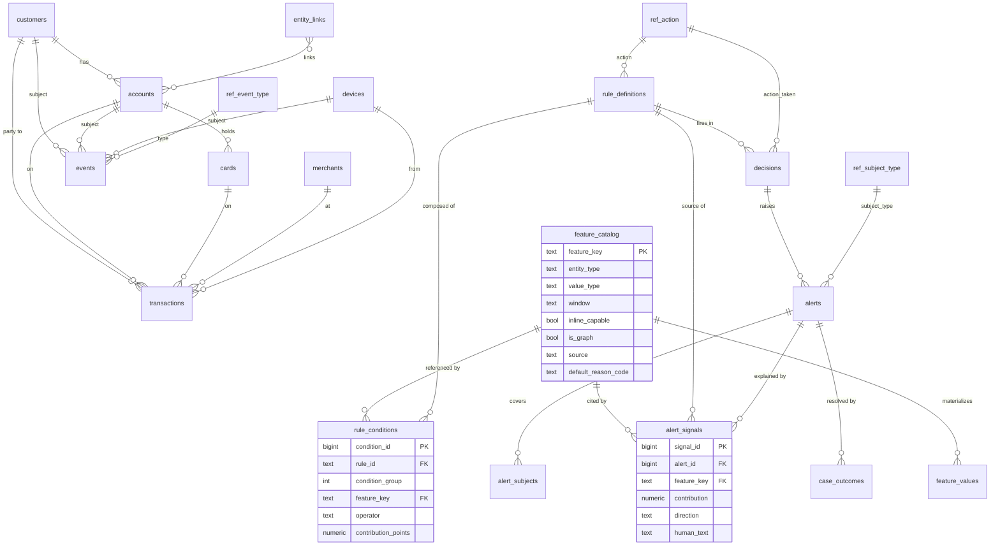

> **Superseded.** Where this document and the seed files under `db/seeds/` disagree
> — catalog size (22 vs 21), three `entity_type` values, and the price of
> `country_is_new_for_customer` (+16 vs +50) — **the seeds are authoritative**.
> Kept unedited as a Week-1 artifact. See README "Known gaps".
# Risk Intelligence & Fraud Detection Platform
## Week 1 Deliverable — Data Model & Synthetic-Data Spec

This is the Week-1 data model: the schema, the seed **feature catalog** and **rule set** (which reproduce the four GlassBox demo alerts), a worked example, and the spec for the synthetic dataset that drives the demo. It is designed to a single principle — **new fraud patterns are inserts, not migrations** — so it fits the four demo alerts without being limited to them.

The schema is written in PostgreSQL. Nothing here assumes a specific fraud pattern in a column or a code path; patterns live in data (`feature_catalog` + `rule_definitions`), which is what keeps the model extensible and every score explainable.

---

## 1. Design principles

The model separates **fixed structure** (tables that never change when a new pattern appears) from **variable content** (rows you add). The test applied to every decision below: *when the 5th, 20th, 50th pattern arrives, does this force a schema change, or just an `INSERT`?*

| When you add a new… | Lands as (extensible) | Never as (hardcoded) |
|---|---|---|
| Contributing signal / reason | row in `alert_signals` | new column on the alert |
| Feature | row in `feature_catalog` | new code branch |
| Detection pattern | row(s) in `rule_definitions` / `rule_conditions` | `if pattern == "x"` |
| Subject / action / event type | row in a `ref_*` table (open enum) | hardcoded constant |
| Raw data field | *(already provisioned in the wide superset + `attributes` JSONB)* | migrate + backfill history |
| Behavioral event kind | new `ref_event_type` value | new table per behavior |
| Score source (rule / ML / graph) | *(model is source-indifferent)* | source-specific handling |

Five structural commitments follow from this and recur throughout the schema:

1. **Signals are child rows, not columns.** An alert's rationale is a one-to-many set of `alert_signals`. Four drivers → four rows; nine → nine. This is the single most important extensibility decision, and it is exactly what the GlassBox score bar iterates over — so a new signal renders for free.
2. **The feature catalog is the extension seam.** Rules reference *features*, not raw fields. Growing detection = registering a feature + composing a rule. Both are data operations.
3. **Rules are data.** All pattern logic is expressible as catalog features + rule rows. The moment logic leaks into application code, extensibility is gone.
4. **Vocabularies are reference tables (open enums).** `subject_type`, `action`, `event_type` etc. are rows, so tomorrow's unforeseen value is an insert.
5. **Raw capture is a wide, sparse superset.** Adding a column to the fact/event tables later is the expensive migration. Capture broadly now (ISO 8583 / ISO 20022 give the vocabulary of what a payment can carry), plus an `attributes` JSONB catch-all, so you never have to backfill a field you failed to store.

Two properties emerge for free: the model is **score-source-indifferent** (a score is just contributing signals landing in child rows, whether from a rule, a gradient-boosted tree, or a graph model), and because a new signal is a child row and a new feature is a catalog entry, **a brand-new pattern arrives already explainable** — same bar, same reason codes.

---

## 2. Layer overview

The model is seven layers. Variability is concentrated in layers 4–5 (catalog + rules); everything else is fixed structure.

| # | Layer | Tables | Role |
|---|---|---|---|
| 0 | Reference / vocabulary | `ref_action`, `ref_subject_type`, `ref_execution_mode`, `ref_event_type`, `ref_reason_code` | Open enums as rows |
| 1 | Dimensions (entities) | `customers`, `accounts`, `cards`, `merchants`, `devices` | Context joined for features |
| 2 | Raw capture (append-only) | `transactions`, `events` | Immutable facts + behavioral event log |
| 3 | Link / edge layer | `entity_links` | Cross-entity graph (mule rings) |
| 4 | **Feature layer** | `feature_catalog`, `feature_values` | The extension seam + point-in-time store |
| 5 | **Detection logic** | `rule_definitions`, `rule_conditions` | Rules-as-data (admin-authored) |
| 6 | Decisioning / output | `decisions`, `alerts`, `alert_subjects`, `alert_signals` | Allow/challenge/block + reviewable alerts |
| 7 | Feedback / labels | `case_outcomes` | Closes the loop; feeds retrain + KPIs |

---

## 3. Entity-relationship diagram



The diagram shows the load-bearing relationships: `feature_catalog` fans out to the store, the rules, and the alert signals (it is the seam); a `rule_definition` is composed of `rule_conditions` that each reference a catalog feature; and an `alert` is explained by many `alert_signals` and can cover many `alert_subjects` (which is how one alert scores a four-account cluster).

---

## 4. Schema (DDL)

### 4.0 Reference / vocabulary

Vocabularies are rows so they can grow without a migration. `ref_action` is the **action ladder** that carries the platform from detection into prevention — the ordered severity is what an inline decision uses to escalate.

```sql
CREATE TABLE ref_action (
    action          TEXT PRIMARY KEY,          -- allow | monitor | alert | challenge | hold | block
    severity        SMALLINT NOT NULL,         -- 0..5, ordered
    is_preventive   BOOLEAN NOT NULL,          -- does it stop the event before it completes?
    description     TEXT
);
INSERT INTO ref_action VALUES
 ('allow',     0, FALSE, 'Let it through'),
 ('monitor',   1, FALSE, 'Allow but flag for passive watch'),
 ('alert',     2, FALSE, 'Raise into the async review queue (classic detection)'),
 ('challenge', 3, TRUE,  'Step-up auth (OTP / 3DS / biometric) before proceeding'),
 ('hold',      4, TRUE,  'Freeze pending manual approval'),
 ('block',     5, TRUE,  'Decline outright');

CREATE TABLE ref_subject_type (
    subject_type    TEXT PRIMARY KEY,          -- transaction | account | card | customer | device | merchant | network
    description     TEXT
);
INSERT INTO ref_subject_type VALUES
 ('transaction',''), ('account',''), ('card',''), ('customer',''),
 ('device',''), ('merchant',''), ('network','A linked cluster of entities');

CREATE TABLE ref_execution_mode (
    mode            TEXT PRIMARY KEY,          -- inline_sync | async
    description     TEXT
);
INSERT INTO ref_execution_mode VALUES
 ('inline_sync','Runs in the authorization path; ms budget; may prevent'),
 ('async','Runs after; seconds-to-minutes; raises alerts');

CREATE TABLE ref_event_type (
    event_type      TEXT PRIMARY KEY,          -- new behavioral kinds are new rows here
    description     TEXT
);
INSERT INTO ref_event_type VALUES
 ('password_reset',''), ('payee_added',''), ('login',''),
 ('mfa_change',''), ('profile_change',''), ('account_open',''),
 ('device_change',''), ('dormancy_break','');

CREATE TABLE ref_reason_code (
    reason_code     TEXT PRIMARY KEY,
    description     TEXT
);
INSERT INTO ref_reason_code VALUES
 ('VELOCITY_SPIKE','Abnormal transaction velocity'),
 ('NEW_DEVICE','First use of an unrecognized device'),
 ('GEO_ANOMALY','Location inconsistent with history'),
 ('NEW_MCC','Merchant category never used by customer'),
 ('STRUCTURING','Amounts structured under a reporting line'),
 ('PASS_THROUGH','Funds forwarded immediately; no genuine activity'),
 ('DEVICE_FANOUT','One device across many accounts'),
 ('CREDENTIAL_EVENT','Recent security event before movement'),
 ('PAYEE_DRAIN','New payee then balance drained'),
 ('DATACENTER_IP','Session from non-residential network'),
 ('BEHAVIOR_DRIFT','Behavioral biometrics differ from profile'),
 ('TRAVEL_EXPLAINED','Location change explained by prior purchase'),
 ('SPEND_NORMAL','Amount/merchant consistent with baseline'),
 ('CARD_PRESENT','Chip-and-PIN / physically present');
```

### 4.1 Dimensions

Slowly-changing context. Keys are tokenized (`card_id`, `account_id`), never raw PANs. Every table carries `attributes JSONB` so new descriptive fields don't require a migration.

```sql
CREATE TABLE customers (
    customer_id       TEXT PRIMARY KEY,
    home_country      TEXT,
    home_lat          NUMERIC, home_lon NUMERIC,
    account_open_date DATE,
    risk_tier         TEXT,
    contact_hash      TEXT,                    -- masked; raw contact never stored here
    attributes        JSONB DEFAULT '{}'::jsonb,
    created_at        TIMESTAMPTZ DEFAULT now(),
    updated_at        TIMESTAMPTZ DEFAULT now()
);

CREATE TABLE accounts (
    account_id    TEXT PRIMARY KEY,
    customer_id   TEXT REFERENCES customers,
    account_type  TEXT,                        -- checking | savings | ...
    open_date     DATE,
    status        TEXT,
    attributes    JSONB DEFAULT '{}'::jsonb
);

CREATE TABLE cards (
    card_id          TEXT PRIMARY KEY,         -- tokenized
    account_id       TEXT REFERENCES accounts,
    issuing_country  TEXT,
    card_type        TEXT,
    first_seen       TIMESTAMPTZ,
    status           TEXT,
    attributes       JSONB DEFAULT '{}'::jsonb
);

CREATE TABLE merchants (
    merchant_id           TEXT PRIMARY KEY,
    name                  TEXT,
    mcc                   TEXT,
    merchant_country      TEXT,
    historical_fraud_rate NUMERIC,
    attributes            JSONB DEFAULT '{}'::jsonb
);

CREATE TABLE devices (
    device_id    TEXT PRIMARY KEY,             -- fingerprint
    first_seen   TIMESTAMPTZ,
    device_type  TEXT,
    attributes   JSONB DEFAULT '{}'::jsonb
);
```

### 4.2 Raw capture — the append-only facts

`transactions` is the immutable fact table, deliberately **wide and sparse**: today's rules read perhaps a third of these columns, but the rest are captured so future rules and the point-in-time store have them. `events` is the behavioral log that a pure transactions table cannot express — it is where account-takeover and future behavioral patterns live, and it extends by adding `ref_event_type` values, never tables.

```sql
CREATE TABLE transactions (
    txn_id         TEXT PRIMARY KEY,
    occurred_at    TIMESTAMPTZ NOT NULL,       -- precise, tz-aware
    amount         NUMERIC NOT NULL,
    currency       TEXT NOT NULL,
    amount_base    NUMERIC,                    -- normalized to base currency
    direction      TEXT,                       -- debit | credit | inbound | outbound
    txn_type       TEXT,                       -- purchase | transfer | withdrawal | payment
    card_id        TEXT REFERENCES cards,
    account_id     TEXT REFERENCES accounts,
    customer_id    TEXT REFERENCES customers,
    merchant_id    TEXT REFERENCES merchants,
    mcc            TEXT,
    channel        TEXT,                        -- cnp | pos | atm | online | wire
    entry_mode     TEXT,                        -- chip_pin | contactless | keyed | ecom
    auth_result    TEXT,                        -- approved | declined
    decline_reason TEXT,
    txn_country    TEXT,
    txn_lat        NUMERIC, txn_lon NUMERIC,
    ip_address     INET,
    device_id      TEXT REFERENCES devices,
    payee_id       TEXT,                        -- for transfers
    counterparty   TEXT,                        -- e.g. external destination
    billing_country  TEXT,
    shipping_country TEXT,
    attributes     JSONB DEFAULT '{}'::jsonb,   -- sparse catch-all; promote to a column when it matures
    ingested_at    TIMESTAMPTZ DEFAULT now()
);

CREATE TABLE events (
    event_id     BIGSERIAL PRIMARY KEY,
    occurred_at  TIMESTAMPTZ NOT NULL,
    event_type   TEXT REFERENCES ref_event_type,
    subject_type TEXT REFERENCES ref_subject_type,
    subject_id   TEXT NOT NULL,                -- the entity the event is about
    ip_address   INET,
    device_id    TEXT,
    attributes   JSONB DEFAULT '{}'::jsonb,
    ingested_at  TIMESTAMPTZ DEFAULT now()
);
```

### 4.3 Link / edge layer

The edge table is what lets the system *know* four accounts are one cluster before it can score the cluster. Promoted from "optional entity resolution" to first-class by the mule-ring case.

```sql
CREATE TABLE entity_links (
    link_id     BIGSERIAL PRIMARY KEY,
    from_type   TEXT REFERENCES ref_subject_type,
    from_id     TEXT NOT NULL,
    to_type     TEXT REFERENCES ref_subject_type,
    to_id       TEXT NOT NULL,
    link_type   TEXT NOT NULL,                 -- shares_device | shares_email | opened_on | transfer_to | same_customer
    first_seen  TIMESTAMPTZ,
    last_seen   TIMESTAMPTZ,
    weight      NUMERIC,
    attributes  JSONB DEFAULT '{}'::jsonb
);
CREATE INDEX ix_links_from ON entity_links (from_type, from_id);
CREATE INDEX ix_links_to   ON entity_links (to_type,   to_id);
```

### 4.4 Feature layer — the extension seam

`feature_catalog` is the registry of everything a rule may reference. The two flags are what tell an admin (and the engine) what a feature can *do*: `inline_capable` decides whether a rule built on it can run in the authorization path and therefore **prevent**, and `is_graph` marks cross-entity features that resolve against `entity_links`. `feature_values` is the point-in-time store — every value is stamped `as_of`, so "count in the last 90 seconds" only ever sees data that existed at that instant (no future leakage). In production the inline slice of this is a low-latency store (e.g. Redis); for the prototype an indexed table is fine.

```sql
CREATE TABLE feature_catalog (
    feature_key         TEXT PRIMARY KEY,
    display_name        TEXT NOT NULL,
    description         TEXT,
    entity_type         TEXT REFERENCES ref_subject_type,  -- what it keys on
    value_type          TEXT NOT NULL,          -- numeric | boolean | categorical | set
    window              TEXT,                   -- '90s' | '24h' | NULL (stateless)
    inline_capable      BOOLEAN NOT NULL,       -- fast enough to back a blocking rule?
    is_graph            BOOLEAN NOT NULL DEFAULT FALSE,
    source              TEXT,                   -- internal | external | derived | event
    default_reason_code TEXT REFERENCES ref_reason_code,
    status              TEXT DEFAULT 'active',
    created_at          TIMESTAMPTZ DEFAULT now()
);

CREATE TABLE feature_values (
    feature_key  TEXT REFERENCES feature_catalog,
    entity_type  TEXT REFERENCES ref_subject_type,
    entity_id    TEXT NOT NULL,
    as_of        TIMESTAMPTZ NOT NULL,          -- point-in-time correctness
    value_num    NUMERIC,
    value_bool   BOOLEAN,
    value_text   TEXT,
    value_json   JSONB,
    computed_at  TIMESTAMPTZ DEFAULT now(),
    PRIMARY KEY (feature_key, entity_type, entity_id, as_of)
);
CREATE INDEX ix_fv_lookup ON feature_values (entity_type, entity_id, feature_key, as_of DESC);
```

### 4.5 Detection logic — rules as data

Because admins compose rules in a UI, a rule is a stored object interpreted at runtime, not code. `rule_conditions.feature_key` is a **foreign key into the catalog** — the database itself enforces the invariant that rules can only be built from registered features. Each condition carries `contribution_points`; a subject's score is the sum of the points of the conditions that fired, which is precisely the additive glassbox model. `signal_template` renders the human-readable line for the alert. Deeply nested boolean logic can escalate into a `rule_logic JSONB` tree on `rule_definitions`; for the demo's patterns, grouped AND/OR conditions are enough.

```sql
CREATE TABLE rule_definitions (
    rule_id                 TEXT PRIMARY KEY,   -- e.g. R-114
    name                    TEXT NOT NULL,
    description             TEXT,
    subject_type            TEXT REFERENCES ref_subject_type,
    execution_mode          TEXT REFERENCES ref_execution_mode,
    action                  TEXT REFERENCES ref_action,   -- the consequence
    review_threshold        NUMERIC,            -- score line at which this rule surfaces
    recommended_action_text TEXT,               -- the nuanced human recommendation (demo "rec")
    clear_text              TEXT,               -- counterfactual: what would clear it (demo "clear")
    status                  TEXT DEFAULT 'active',  -- active | shadow | inactive
    rule_logic              JSONB,              -- optional: complex nested trees
    combine                 TEXT DEFAULT 'AND', -- how condition groups combine
    created_by              TEXT,
    created_at              TIMESTAMPTZ DEFAULT now(),
    version                 INT DEFAULT 1,
    shadow_since            TIMESTAMPTZ         -- set while shadow-testing before go-live
);

CREATE TABLE rule_conditions (
    condition_id       BIGSERIAL PRIMARY KEY,
    rule_id            TEXT REFERENCES rule_definitions ON DELETE CASCADE,
    condition_group    INT DEFAULT 1,           -- groups OR'd/AND'd together
    feature_key        TEXT REFERENCES feature_catalog,  -- enforced: rules reference the catalog
    operator           TEXT NOT NULL,           -- > | >= | < | <= | = | != | in
    threshold_num      NUMERIC,
    threshold_text     TEXT,
    contribution_points NUMERIC NOT NULL,       -- signed; negative = mitigating
    reason_code        TEXT REFERENCES ref_reason_code,
    signal_template    TEXT                     -- human line for the alert signal
);
```

### 4.6 Decisioning / output

`decisions` records **every** subject that passes through decisioning, including the silent allows — this is what powers the block-rate and false-positive-on-blocks KPIs and, crucially, distinguishes prevention from detection. `alerts` is only the reviewable subset. An alert's `subject_type` is generalized (a ring alert has `subject_type = 'network'`), and `alert_subjects` lets one alert cover the four member accounts. `alert_signals` is the one-to-many rationale — the table the whole model is organized around, carrying both aggravating and **mitigating** (negative) contributions, and citing either a `feature_key` (rule/catalog) or a free-text `source_model` (ML), which is what makes the record score-source-indifferent.

```sql
CREATE TABLE decisions (
    decision_id    BIGSERIAL PRIMARY KEY,
    subject_type   TEXT REFERENCES ref_subject_type,
    subject_id     TEXT NOT NULL,
    occurred_at    TIMESTAMPTZ,                 -- when the event happened
    decided_at     TIMESTAMPTZ DEFAULT now(),
    execution_mode TEXT REFERENCES ref_execution_mode,
    score          NUMERIC,
    band           TEXT,                        -- high | elevated | low (derived from score)
    action_taken   TEXT REFERENCES ref_action,
    fail_mode      TEXT,                        -- open | closed  (inline timeout policy applied)
    model_ref      TEXT,                        -- free text, e.g. 'gradient-boost v3.2'; source-indifferent
    rules_fired    TEXT[]                       -- rule_ids that contributed
);

CREATE TABLE alerts (
    alert_id     BIGSERIAL PRIMARY KEY,
    decision_id  BIGINT REFERENCES decisions,   -- nullable; a network alert may aggregate several
    subject_type TEXT REFERENCES ref_subject_type,
    subject_id   TEXT,                           -- primary/named subject
    title        TEXT,
    score        NUMERIC,
    band         TEXT,
    status       TEXT DEFAULT 'open',           -- open | escalated | false_positive | resolved
    assigned_to  TEXT,
    created_at   TIMESTAMPTZ DEFAULT now()
);

CREATE TABLE alert_subjects (               -- for multi-entity alerts (the mule ring)
    alert_id     BIGINT REFERENCES alerts ON DELETE CASCADE,
    subject_type TEXT REFERENCES ref_subject_type,
    subject_id   TEXT NOT NULL,
    role         TEXT,                          -- e.g. member | collector | device
    PRIMARY KEY (alert_id, subject_type, subject_id)
);

CREATE TABLE alert_signals (                -- THE one-to-many rationale; renders the score bar
    signal_id    BIGSERIAL PRIMARY KEY,
    alert_id     BIGINT REFERENCES alerts ON DELETE CASCADE,
    feature_key  TEXT REFERENCES feature_catalog,   -- nullable if the signal came from a model
    contribution NUMERIC NOT NULL,               -- signed; negative = mitigating
    direction    TEXT,                            -- aggravating | mitigating
    human_text   TEXT NOT NULL,
    reason_code  TEXT REFERENCES ref_reason_code,
    source_rule_id TEXT REFERENCES rule_definitions,
    source_model TEXT,
    rank         INT
);
CREATE INDEX ix_signals_alert ON alert_signals (alert_id, rank);
```

### 4.7 Feedback / labels

The inbound path of the pipeline: analyst dispositions become labels for retraining and the source of the false-positive / false-negative KPIs. A `blocked` decision later dispositioned `confirmed_legit` is a prevention false positive — exactly the case the system must be able to learn from.

```sql
CREATE TABLE case_outcomes (
    outcome_id   BIGSERIAL PRIMARY KEY,
    alert_id     BIGINT REFERENCES alerts,
    disposition  TEXT NOT NULL,                 -- confirmed_fraud | false_positive | confirmed_legit | inconclusive
    analyst_id   TEXT,
    decided_at   TIMESTAMPTZ DEFAULT now(),
    notes        TEXT,
    feeds_retrain BOOLEAN DEFAULT TRUE
);
```

**Band function** (global, applied to any score): `high ≥ 70`, `elevated 45–69`, `low < 45`. A rule's own `review_threshold` is separate — it is the line at which that rule surfaces for review and drives the inline action.

---

## 5. Feature catalog (seed)

This is the seam populated for Week 1. It covers the four demo alerts and adds a few unrelated features to demonstrate that the catalog — not code — is where detection grows. `Inline` = can back a preventive rule; `Graph` = resolves against `entity_links`.

| feature_key | Keys on | Type | Window | Inline | Graph | Source | Reason code |
|---|---|---|---|---|---|---|---|
| `card_cnp_count` | card | numeric | 90s | ✅ | | derived | VELOCITY_SPIKE |
| `card_cnp_pace_ratio` | card | numeric | 90s vs 30d | ✅ | | derived | VELOCITY_SPIKE |
| `device_first_seen_min` | device | numeric | — | ✅ | | event | NEW_DEVICE |
| `session_geo_jump_km` | card | numeric | vs last session | ⚠️ cached | | external | GEO_ANOMALY |
| `mcc_is_new_for_customer` | customer | boolean | — | ✅ | | derived | NEW_MCC |
| `accounts_per_device` | device | numeric | 7d | | ✅ | derived | DEVICE_FANOUT |
| `structuring_flag` | account | boolean | 24h | | | derived | STRUCTURING |
| `pass_through_ratio` | account | numeric | 24h | | ✅ | derived | PASS_THROUGH |
| `passthrough_time_min` | account | numeric | — | | | derived | PASS_THROUGH |
| `activity_is_passthrough_only` | account | boolean | 7d | | | derived | PASS_THROUGH |
| `ring_cohesion` | network | numeric | — | | ✅ | derived | DEVICE_FANOUT |
| `min_since_password_reset` | account | numeric | — | ✅ | | event | CREDENTIAL_EVENT |
| `new_payee_then_drain` | account | boolean | sequence | | | derived | PAYEE_DRAIN |
| `ip_is_datacenter` | transaction | boolean | — | ⚠️ cached | | external | DATACENTER_IP |
| `behavior_deviation` | customer | numeric | session | | | external | BEHAVIOR_DRIFT |
| `country_is_new_for_customer` | customer | boolean | — | ✅ | | derived | GEO_ANOMALY |
| `recent_travel_purchase` | customer | boolean | 7d | ✅ | | derived | TRAVEL_EXPLAINED |
| `amount_vs_baseline_z` | customer | numeric | — | ✅ | | derived | SPEND_NORMAL |
| `entry_mode_chip_pin` | transaction | boolean | — | ✅ | | derived | CARD_PRESENT |
| `card_txn_count_24h` *(extra)* | card | numeric | 24h | ✅ | | derived | VELOCITY_SPIKE |
| `amount_over_avail_balance_pct` *(extra)* | account | numeric | — | ✅ | | derived | PAYEE_DRAIN |
| `merchant_decline_burst` *(extra)* | merchant | numeric | 10m | ✅ | | derived | VELOCITY_SPIKE |

Note how the flags read the architecture: the CNP-burst features are all inline, so R-114 can genuinely *prevent*; the ring features are graph and not inline, so a ring rule can only *alert* (you cannot block a cluster inside a single authorization anyway); the external features (`session_geo_jump_km`, `ip_is_datacenter`) are inline **only if** their lookups are cached.

A representative seed insert (the rest follow the same shape):

```sql
INSERT INTO feature_catalog
 (feature_key, display_name, entity_type, value_type, window, inline_capable, is_graph, source, default_reason_code) VALUES
 ('card_cnp_count','CNP charges in window','card','numeric','90s',TRUE,FALSE,'derived','VELOCITY_SPIKE'),
 ('accounts_per_device','Accounts opened on device','device','numeric','7d',FALSE,TRUE,'derived','DEVICE_FANOUT'),
 ('min_since_password_reset','Minutes since password reset','account','numeric',NULL,TRUE,FALSE,'event','CREDENTIAL_EVENT'),
 ('recent_travel_purchase','Recent travel purchase on file','customer','boolean','7d',TRUE,FALSE,'derived','TRAVEL_EXPLAINED');
```

---

## 6. Seed rule set — reproducing the four demo alerts

The four alerts require **four rule shapes**, which is what the engine and catalog must support beyond simple thresholds:

- **Row-level** — conditions on one transaction (R-114, T-021)
- **Graph / cross-entity aggregate** — conditions over a linked cluster (L-203)
- **Sequence** — ordered events in a window (S-077)
- **Mitigating contributions** — negative points that pull a score down (T-021)

Each rule's condition points sum to the demo score exactly.

### R-114 · Card-not-present burst → `challenge` (inline)

Subject `transaction`, inline, review threshold 70. Score **87 → high**.

| Condition | Points | Reason |
|---|---|---|
| `card_cnp_count ≥ 5` (12× pace) | +34 | VELOCITY_SPIKE |
| `device_first_seen_min < 6` | +21 | NEW_DEVICE |
| `session_geo_jump_km > 1400` | +18 | GEO_ANOMALY |
| `mcc_is_new_for_customer = true` | +14 | NEW_MCC |

Recommended action: *hold pending charges, trigger step-up by phone*. Clears if: *a passed step-up from a known device drops device + location → 34, below the line.*

### L-203 · Mule ring → `hold` (async, graph)

Subject `network`, async, review threshold 55. Score **64 → elevated**. Four *moderate* signals, none individually alarming, jointly crossing the line — the native mode of an additive score, and the reason correlation lives across a **cluster**, not one transaction.

| Condition | Points | Reason |
|---|---|---|
| `accounts_per_device > 3` | +22 | DEVICE_FANOUT |
| `structuring_flag = true` | +17 | STRUCTURING |
| `pass_through_ratio > 0.9` | +15 | PASS_THROUGH |
| `activity_is_passthrough_only = true` | +10 | PASS_THROUGH |

### S-077 · Account takeover → `hold` (sequence)

Subject `account`, async, review threshold 55. Score **58 → elevated**. Spine of the case is the **event log**, not the transaction.

| Condition | Points | Reason |
|---|---|---|
| `min_since_password_reset < 11` | +19 | CREDENTIAL_EVENT |
| `new_payee_then_drain = true` | +18 | PAYEE_DRAIN |
| `ip_is_datacenter = true` | +13 | DATACENTER_IP |
| `behavior_deviation > threshold` | +8 | BEHAVIOR_DRIFT |

### T-021 · Foreign POS after flight → `allow` (mitigating)

Subject `transaction`, review threshold 70. Score **31 → low → release**. Demonstrates **negative** contributions producing a low score and an *allow* — the false positive you are trying not to create.

| Condition | Points | Reason |
|---|---|---|
| `country_is_new_for_customer = true` | +16 | GEO_ANOMALY |
| `recent_travel_purchase = true` | −9 | TRAVEL_EXPLAINED |
| `amount_vs_baseline_z` normal | −6 | SPEND_NORMAL |
| `entry_mode_chip_pin = true` | −4 | CARD_PRESENT |

Seed SQL for these four (definitions + conditions):

```sql
INSERT INTO rule_definitions
 (rule_id, name, subject_type, execution_mode, action, review_threshold, recommended_action_text, status) VALUES
 ('R-114','Card-not-present burst','transaction','inline_sync','challenge',70,
   'Hold the pending charges and trigger step-up verification by phone.','active'),
 ('L-203','Possible mule ring','network','async','hold',55,
   'Open a network case over all linked accounts and freeze outbound transfers. Do not contact holders yet.','active'),
 ('S-077','Account takeover pattern','account','async','hold',55,
   'Pause the transfer and confirm with the owner on the registered phone number, not in-app.','active'),
 ('T-021','Foreign POS after flight','transaction','inline_sync','allow',70,
   'Release. The location change is explained by the ticket purchase.','active');

INSERT INTO rule_conditions
 (rule_id, feature_key, operator, threshold_num, threshold_text, contribution_points, reason_code, signal_template) VALUES
 -- R-114
 ('R-114','card_cnp_count','>=',5,NULL,34,'VELOCITY_SPIKE','{n} card-not-present charges in 90 seconds — 12x this card''s normal pace'),
 ('R-114','device_first_seen_min','<',6,NULL,21,'NEW_DEVICE','New device fingerprint, first seen {v} minutes ago'),
 ('R-114','session_geo_jump_km','>',1400,NULL,18,'GEO_ANOMALY','IP location {v} km from last known session'),
 ('R-114','mcc_is_new_for_customer','=',NULL,'true',14,'NEW_MCC','Merchant category (gift cards) never used on this account'),
 -- L-203
 ('L-203','accounts_per_device','>',3,NULL,22,'DEVICE_FANOUT','Same device used to open {v} accounts this week'),
 ('L-203','structuring_flag','=',NULL,'true',17,'STRUCTURING','Inbound transfers structured just under the reporting line'),
 ('L-203','pass_through_ratio','>',0.9,NULL,15,'PASS_THROUGH','Funds forwarded out within minutes of arrival'),
 ('L-203','activity_is_passthrough_only','=',NULL,'true',10,'PASS_THROUGH','No payroll, card, or bill activity — pass-through only'),
 -- S-077
 ('S-077','min_since_password_reset','<',11,NULL,19,'CREDENTIAL_EVENT','Password reset {v} minutes before this transfer'),
 ('S-077','new_payee_then_drain','=',NULL,'true',18,'PAYEE_DRAIN','New payee added, then paid the full available balance'),
 ('S-077','ip_is_datacenter','=',NULL,'true',13,'DATACENTER_IP','Session routed through a datacenter IP, not residential'),
 ('S-077','behavior_deviation','>',0.5,NULL,8,'BEHAVIOR_DRIFT','Typing cadence differs from the owner''s 90-day profile'),
 -- T-021 (note the negative points)
 ('T-021','country_is_new_for_customer','=',NULL,'true',16,'GEO_ANOMALY','First transaction in this country — location changed since yesterday'),
 ('T-021','recent_travel_purchase','=',NULL,'true',-9,'TRAVEL_EXPLAINED','Airline ticket purchased on this card 3 days ago'),
 ('T-021','amount_vs_baseline_z','<',1.0,NULL,-6,'SPEND_NORMAL','Amount and merchant type match normal spending'),
 ('T-021','entry_mode_chip_pin','=',NULL,'true',-4,'CARD_PRESENT','Chip-and-PIN present — card physically used');
```

---

## 7. Worked example — the mule ring as rows

This shows the schema handling **cross-entity correlation**, the case single-transaction cases don't exercise. Device `F-90d2` opens four accounts; funds land under the reporting line and are forwarded within minutes to collector `••8830`, then out.

**Edges** (`entity_links`) — how the system knows it's one cluster:

```sql
-- device opened four accounts
INSERT INTO entity_links (from_type, from_id, to_type, to_id, link_type) VALUES
 ('device','F-90d2','account','ACC-8830','opened_on'),
 ('device','F-90d2','account','ACC-771','opened_on'),
 ('device','F-90d2','account','ACC-7702','opened_on'),
 ('device','F-90d2','account','ACC-7745','opened_on'),
-- funds forwarded to the collector, then external
 ('account','ACC-7771','account','ACC-8830','transfer_to'),
 ('account','ACC-8830','account','EXT-0001','transfer_to');
```

**The alert** — note `subject_type = 'network'`, impossible without the generalized subject:

```sql
INSERT INTO alerts (alert_id, subject_type, subject_id, title, score, band, status)
 VALUES (1187,'network','RING-1187','Possible mule ring — 4 linked accounts',64,'elevated','open');

INSERT INTO alert_subjects (alert_id, subject_type, subject_id, role) VALUES
 (1187,'account','ACC-8830','collector'),
 (1187,'account','ACC-7771','member'),
 (1187,'account','ACC-7702','member'),
 (1187,'account','ACC-7745','member'),
 (1187,'device','F-90d2','device');
```

**The rationale** — four child rows, which are exactly what the GlassBox bar renders:

```sql
INSERT INTO alert_signals (alert_id, feature_key, contribution, direction, human_text, reason_code, source_rule_id, rank) VALUES
 (1187,'accounts_per_device',22,'aggravating','Same device used to open 4 accounts this week','DEVICE_FANOUT','L-203',1),
 (1187,'structuring_flag',17,'aggravating','Inbound transfers structured just under the $2,500 line','STRUCTURING','L-203',2),
 (1187,'pass_through_ratio',15,'aggravating','Funds forwarded out within minutes of arrival on all 4','PASS_THROUGH','L-203',3),
 (1187,'activity_is_passthrough_only',10,'aggravating','No payroll, card, or bill activity — pass-through only','PASS_THROUGH','L-203',4);
```

Everything the console needs — the 64, the band, the four-signal breakdown, the four covered accounts, the graph — reads back from these rows. Add a fifth ring signal later and it is one more `alert_signals` row; nothing else changes.

---

## 8. Synthetic-data spec

The dataset must do two things: give features a **history to be abnormal against** (a "never-used MCC" or "new country" is meaningless without a baseline), and reproduce the four demo alerts exactly. Generate in strict time order — **all background history first, planted fraud last** — so the point-in-time `as_of` values are honest and no feature sees the future.

**Volumes** (a demo-sized, not load-test, dataset):

| Entity | Count |
|---|---|
| customers | ~50 |
| accounts | ~80 |
| cards | ~120 |
| merchants | ~40 |
| devices | ~30 |
| transactions | ~15,000 over 30 days |
| events | ~2,000 |
| Fraudulent share | ~1–2% (realistic class imbalance) |

**Background layer.** Per customer, a plausible home country/geo and a 30-day stream of ordinary transactions: recurring merchants, normal amounts, home-country POS, a stable device or two. This populates the baselines (`amount_vs_baseline_z`, historical MCC/country sets, normal pace) that make the four cases stand out.

**Planted case A — TXN-48291 (CNP burst, score 87).** Card `••4417` / M. Okafor with a benign 30-day history (so `card_cnp_pace_ratio` ≈ 12×). Then, within 90 seconds: 5 CNP gift-card (`mcc` never used) charges, from a `device_id` whose `first_seen` is 6 minutes earlier, on an `ip_address` geolocating ~1,400 km from the prior session. → R-114 fires inline, `challenge`.

**Planted case B — CASE-1187 (mule ring, score 64).** Device `F-90d2` with four `account_open` events this week for `ACC-8830` (+3). Each account: one inbound transfer just under $2,500, an outbound to the collector minutes later, and **no** purchase/payroll/bill transactions. Edges as in §7. → L-203 fires async on the `network` subject, `hold`.

**Planted case C — TXN-48260 (takeover, score 58).** Account `••2201` / S. Haddad. Event sequence: `password_reset` at T, `payee_added` at T+6m, then a `transfer` at T+11m draining the balance, on a datacenter `ip_address`. The sequence — not any single row — is the signal. → S-077 fires, `hold`.

**Planted case D — TXN-48251 (travel FP, score 31).** Card `••9954` / J. Mensah. In history: an airline `transaction` to LIS 3 days prior. Then a €86.20 restaurant charge in Portugal, `entry_mode = chip_pin`, amount within the customer's norm. Mitigating features dominate → T-021 scores 31, `allow`. This case exists to prove the system *doesn't* flag it.

**Extensibility hook (the demo climax).** Ship the dataset with the seeds of a **fifth** pattern that has *no rule yet* — e.g. a single merchant receiving a burst of small declined authorizations (card-testing), `subject_type = merchant`. On stage, add one catalog feature (`merchant_decline_burst`, already listed as an "extra") and author one rule against it in the admin UI; the next replayed transaction fires it, renders its reasons, and writes its reason codes — **no deploy, no migration**. The four alerts prove the engine; the live add proves the architecture.

---

## 9. How to extend (insert, not migrate)

The recipe, mapped to the real tables. Adding any new fraud pattern is four inserts and zero DDL:

1. **Register the feature(s)** → `INSERT INTO feature_catalog …`, setting `inline_capable` (can it block?) and `is_graph` (cross-entity?).
2. **Ensure values are computed** → the pipeline writes `feature_values` stamped `as_of` (point-in-time).
3. **Author the rule** → `INSERT INTO rule_definitions …` + `INSERT INTO rule_conditions …`, referencing the catalog features (the FK enforces this) with `contribution_points` and an `action` from the ladder. Start it `status = 'shadow'` to shadow-test against history before it goes live.
4. **Done.** The engine picks it up; scores land in `decisions`; a surfaced alert writes `alert_signals` that render in the console with reason codes already attached.

No new column, no new code branch, no redeploy. The proof the design succeeded is not a large rule set — it is being able to add pattern nine, live, without touching the schema.

---

## 10. What this delivers, and open questions

**Delivers for Week 1:** the data model/schema (§4), a sample-dataset spec ready to generate (§8), and — beyond the brief — the seed catalog and rule set that make the four demo alerts reproducible from data alone. This is the foundation Week 2 (architecture + backend: pipeline, rule engine, scoring API, alert generation) builds on directly.

**Decisions to confirm with the team before building:**

- **Store choice.** Postgres throughout for the prototype (with the inline `feature_values` slice indexed), or introduce a cache (Redis) for the inline path now to make the prevention latency story literal?
- **Rule logic representation.** Normalized `rule_conditions` (chosen here — inspectable, catalog-FK-enforced) is enough for the demo's four shapes. Confirm we don't need the `rule_logic` JSONB tree for deeper nesting in scope.
- **Behavioral biometrics.** `behavior_deviation` (typing cadence) is the one signal needing a data source beyond transactions + events. Keep it in the takeover rule as a synthetic feature, or drop it from the demo and note it as future work?
- **Inline vs async per rule.** R-114 and T-021 are modeled inline (preventive); L-203 and S-077 async. Confirm this split matches the prevention story you want to demo.
